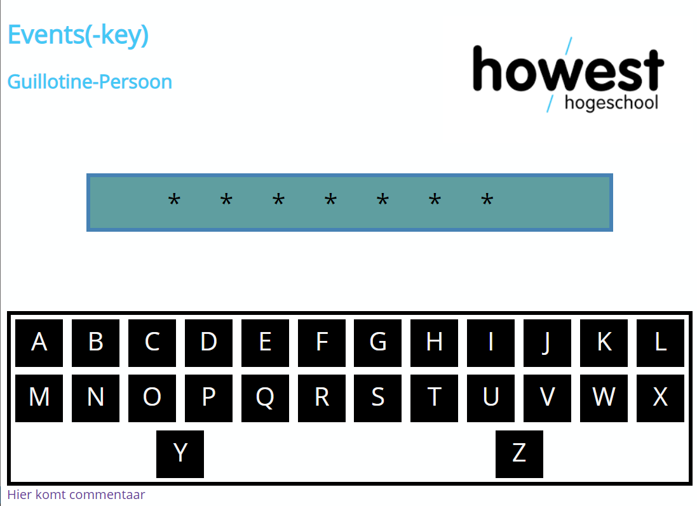
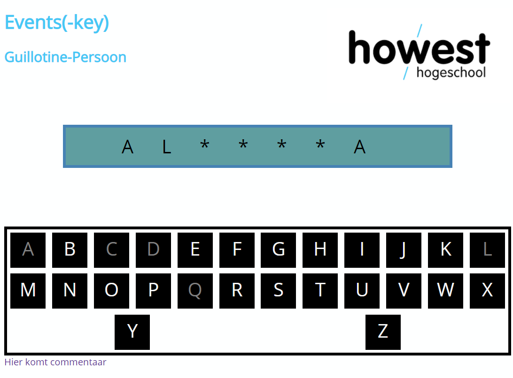
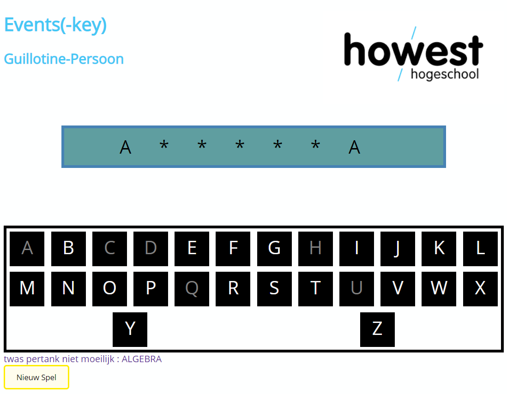
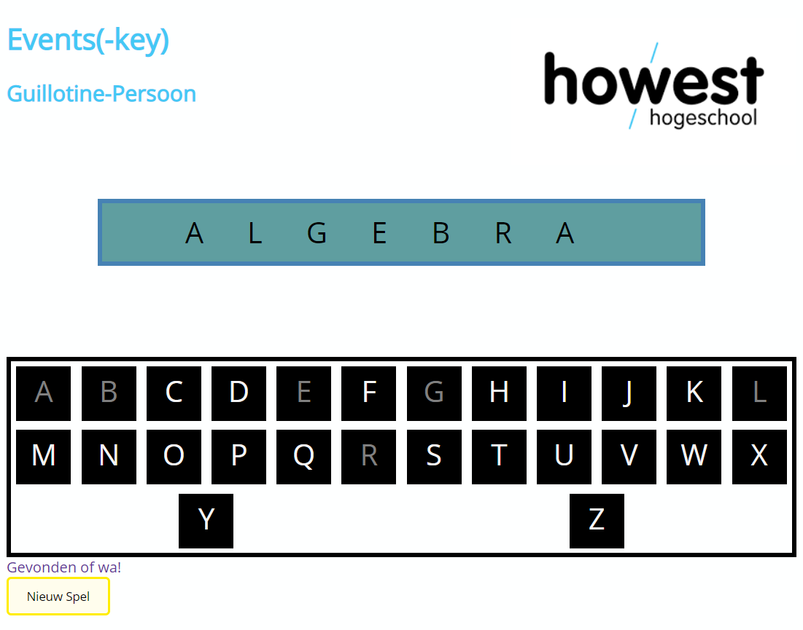

# Hangman
Maak een variant op Hangman
# Logica
* De gebruiker krijgt '*' te zien die aangeeft hoelang het te zoeken woord is.
* De gebruiker krijgt de letters van het alfabet te zien.
* Bij aanklikken correcte letter in woord komen de klinkers (of medeklinkers) zichtbaar.
	* Reeds aangeklikte letters kunnen niet meer gekozen worden.
* Bij aanklikken van een letter die niet in het woord voorkomt :
	* Wordt het aantal misser bijgehouden
	* De gebruiker kan maximum 5 missers hebben
	* Wanneer teveel missers worden gemaakt wordt het spel beëindigd en kan de gebruiker een nieuw spel opstarten.
* Bij speleinde
	* Het spel eindigt als de gebruiker het woord geraden heeft. Zorg voor een passende melding.
Gebruik een Array om enkele woorden bij te houden, uit deze woorden wordt random een woord gekozen, bij elk nieuw spel.

# Sfeerbeelden
## Opstart

## Tijdens Spel

## Speleinde

